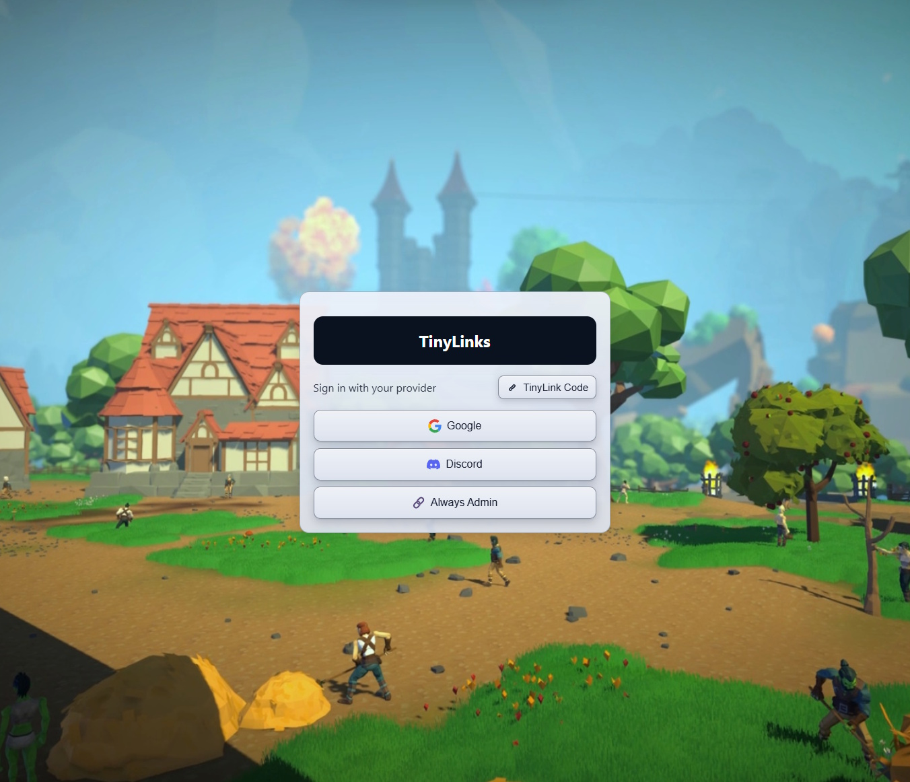

<div align="center">
  
  <h1>TinyLinks</h1>
  <p>A lightweight OAuth-only identity broker with simple masquerading and signed JWTs for downstream apps.</p>
</div>

---

## Overview

TinyLinks is a minimal service that places an OAuth login screen in front of your applications. It issues signed JWTs to identify users but **does not perform authorization** -- anyone who successfully authenticates is considered logged in.

Features:

* **OAuth/OIDC only** — supports providers like GitHub, Google, Discord, and any generic OIDC identity provider.
* **No user/passwords, no TOTP** — only external OAuth flows.
* **Tiny Links** — a one-time short link maps one account ID to another, allowing one authentication method to masquerade as another, enabling a simple form of account linking.
* **OIDC/OAuth2 Flow** — downstream apps initiate typical OAuth2 login and receive a code, then call token endpoint with the code to receive an RS256-signed JWT. Public keys are exposed via standard OIDC discovery endpoints.
* **Prometheus & health endpoints** for monitoring.
* **Static content hosting** for a minimal login frontend.

This project started as a customization of [TinyAuth](https://github.com/steveiliop56/tinyauth) but is now a full rewrite, in C#.



---

## Quick Start

Build and run via Docker:

```bash
docker build -t tinylinks:latest .
docker run -p 17777:17777 \
  -v /your/data:/data \
  tinylinks:latest \
	--log_config console,5 \
	--conn_bindurl http://+:17777/ \
	--advertise_urls http://localhost:17777/,http://internal-name:8000/foo/ \
	--storage_config data \
	--static_root static_root \
	--session_duration 3600 \
	--linkcreate_secret somesecret \
	--auth_config \
		openid,google,<yourclientid>,<clientsecret> \
		always \
		discord,<clientid>,<clientsecret> \
```

Then open `http://localhost:17777/` to see the login screen.  Note: **this is not how you use it**, just proof it runs.

---

## Configuration

TinyLinks is configured entirely via command line options:

| Option                | Required | Example                   | Description                                                                                                              |
| --------------------- | -------- | ------------------------- | ------------------------------------------------------------------------------------------------------------------------ |
| `--log_config`        | No       | `console,2`               | Logging output: `console,#` or `file,#,/path/file.log` where # is verbosity (0–4).                                       |
| `--conn_bindurl`      | No       | `http://+:17777/`         | Bind address for the webserver. `/health` and `/metrics` always available here.  Can include subpaths.                   |
| `--storage_config`    | Yes      | —                         | Path for dynamic storage. When a tinylink is used, a tiny file is written that indicates the masqueraded account id.     |
| `--auth_config`       | Yes      | —                         | Upstream OAuth providers. Multiple providers can be specified separated by spaces.                                       |
| `--session_duration`  | No       | `3600`                    | JWT cookie duration in seconds before re-login through upstreams is required.                                            |
| `--linkcreate_secret` | Yes      | —                         | Secret required to generate masquerade links. When prompted by user, your server makes this call, displays code to user. |
| `--advertise_urls`    | Yes      | `http://localhost:17777/` | Comma-separated URLs the server should recognize as its public base. Can include subpaths.                               |
| `--static_root`       | No       | `/app/static_root`        | Path to static client files (e.g. index.html with login buttons).                                                        |

---

## Endpoints

TinyLinks exposes the following endpoints:

* **Health & Metrics**

  * `/health` — liveness probe.
  * `/metrics` — Prometheus metrics.

* **OpenID Discovery**

  * `/.well-known/openid-configuration` — OIDC discovery document.
  * `/.well-known/jwks.json` — RSA public keys for JWT validation.

* **OAuth Flow**

  * `/api/oauth/url` — Downstream authorize endpoint.  You call this with the typical complement of query parameters (state, redirect_url, and so on).  Will not work if you skip this step.
  * `/api/oauth/upstream` — Buttons on the HTML page use this to start upstream provider flow (`?provider=google`).
  * `/api/oauth/callback` — Provider callback.
  * `/api/oidc/token` — Token exchange endpoint (supports PKCE).

* **Masquerading**

  * `/api/link/create?secret=<linkcreate_secret>` — Create one-time masquerade code (requires valid session). When the user asks to, make a call server-to-server to generate a code, then display it to the user. It can only be used once, and must be within an hour.
  * `/api/link/unlink` — Remove masquerade mapping.

* **Static Client**

  * `/` and any other path — Serves files from `/app/static_root` or wherever.  / is mapped to index.html, as you would expect.

---

## Limitations

* No built-in user authorization: all authenticated users are treated the same.
* No username/password or multi-factor login. Upstream OAuth providers should do that.
* No storage of any PII information, except logging, and you can turn that down so it does not log, or comment it out.
* Masquerading is intentionally simple and not a replacement for proper account linking in a full identity provider.
* The 'Always' authentication system is literally a passthrough that provides the Admin role.  Good for testing before bothering to set up upstream OAuth2 client IDs.  Just **remember to remove it from the command line** and remove also take the button out of the HTML file. Handy in test scenarios, but obviously not for production.

---

## Contributing

Contributions are welcome! Open an issue or pull request with improvements or fixes.

---

## Acknowledgements

* Inspired by [TinyAuth](https://github.com/steveiliop56/tinyauth) by **steveiliop56**.

---

## License

TinyLinks is licensed under the **MIT No Attribution** license. See [LICENSE](./LICENSE).
