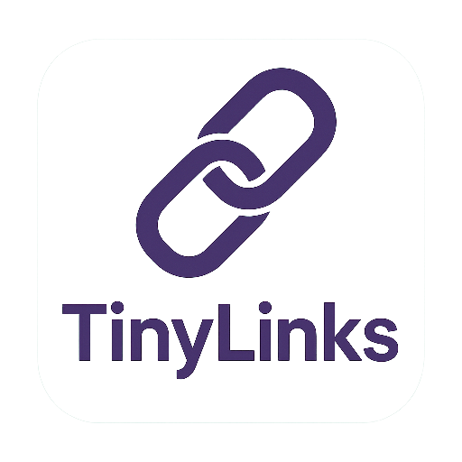
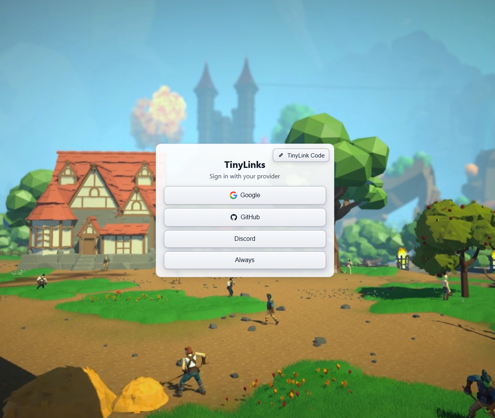

    
    <h1>TinyLinks</h1>
    
Lightweight, OAuth-only identity broker with account masquerading to provide account ids to apps.

 

TinyLinks is a minimal service that puts an OAuth login screen in front of your apps. It focuses on OAuth providers (e.g., GitHub, Google, generic OIDC) and intentionally does not support username/password or TOTP.  It does have a short link one-time-password that creates a masquerade function so logging in with one account will provide the downstream app with another account "sub" field.  This is like poor man's account linking.  THERE IS NO AUTHORIZATION.  Everyone who logs in has access, but will have a valid account id.  The redirect url receives a JWT signed by the TinyLinks server in a cookie, and also hosts /.well-known/openid_configuration so the public key can be used to verify the JWT.

## Getting Started

- Build the docker container (see build.bat) and push it to whatever repo you use.
- Configure your OAuth providers (GitHub/Google/Discord/etc) and app settings on the command line.
	- Note that setting up multiple auth providers, just use the flag once and give each definition separated by a space, one after the other.
- Edit the index.html to have buttons for each provider (configs are not pushed from the server (yet?))

## Contributing

Contributions are welcome. Please open an issue or pull request with improvements or fixes.

## Acknowledgements

This project started as a customization of TinyAuth, but ended up in a total rewrite. Credit and thanks to the original author and community:
- Originally based on TinyAuth by steveiliop56 — https://github.com/steveiliop56/tinyauth

## License

TinyLinks is licensed under the MIT No Attribution license.  Do whatever you want with this.  See the [LICENSE](./LICENSE) file for details.
